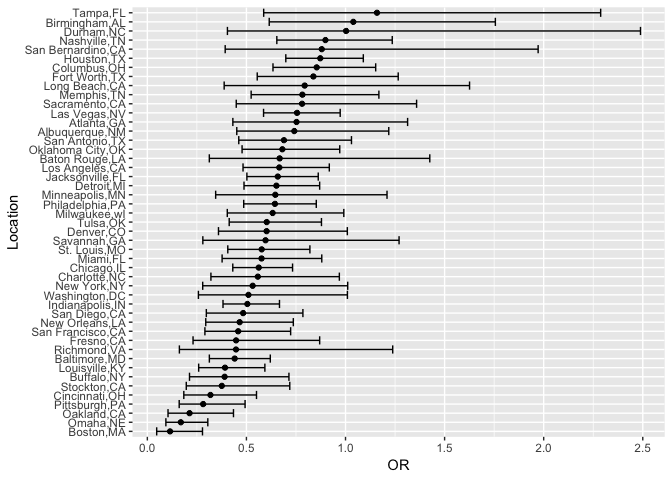
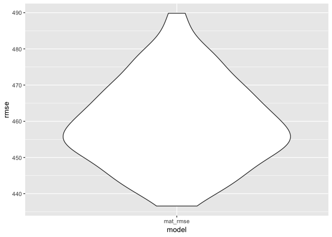
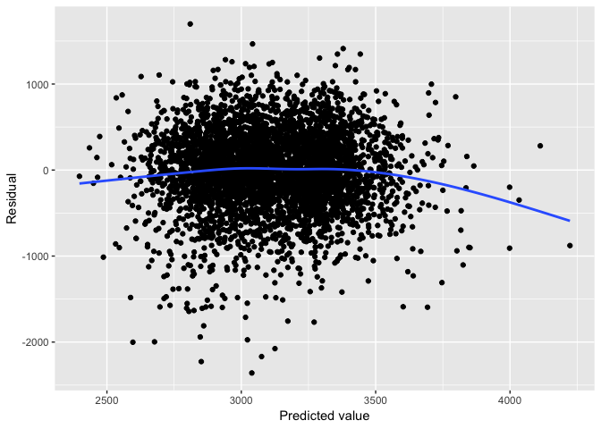
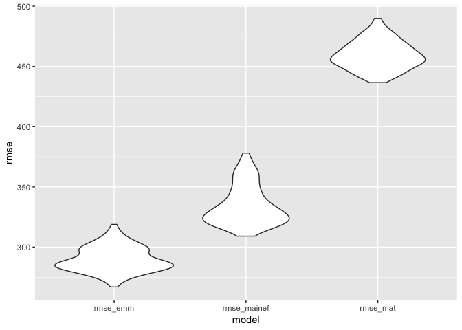

Data Science HW \#6
================
Nathalie Fadel
11/19/2018

Problem 1
=========

Data import and cleaning
------------------------

``` r
murder_data = read_csv("https://raw.githubusercontent.com/washingtonpost/data-homicides/master/homicide-data.csv")
```

    ## Parsed with column specification:
    ## cols(
    ##   uid = col_character(),
    ##   reported_date = col_integer(),
    ##   victim_last = col_character(),
    ##   victim_first = col_character(),
    ##   victim_race = col_character(),
    ##   victim_age = col_character(),
    ##   victim_sex = col_character(),
    ##   city = col_character(),
    ##   state = col_character(),
    ##   lat = col_double(),
    ##   lon = col_double(),
    ##   disposition = col_character()
    ## )

``` r
murder_data = murder_data %>%
  unite("city_state", c("city", "state"), sep = ",", remove = TRUE)

murder_data = murder_data %>%
  mutate(solved_case = ifelse(disposition == c("Closed by arrest"), 1, 0)) %>%
  mutate(victim_race = ifelse(victim_race != "White", "Non-White", "White")) %>%
  mutate(victim_race = forcats::fct_relevel(victim_race, "White", "Non-White")) %>%
  mutate(victim_age = as.numeric(victim_age)) %>%
  mutate(victim_sex = forcats::fct_relevel(victim_sex, "Male", "Female", "Unknown"))
```

    ## Warning in evalq(as.numeric(victim_age), <environment>): NAs introduced by
    ## coercion

``` r
murder_data = murder_data %>%
  filter(!(city_state %in% c("Dallas,TX", "Phoenix,AZ", "Kansas City,MO", "Tulsa,AL")))  
```

Logistic Regression
-------------------

``` r
baltimore_df = murder_data %>%
  filter(city_state %in% c("Baltimore,MD")) %>%
  select(solved_case, victim_age, victim_race, victim_sex)
  
baltimore_logistic = 
  baltimore_df %>% 
  glm(solved_case ~ victim_age + victim_race + victim_sex, data = ., family = binomial()) 

broom::tidy(baltimore_logistic) %>%
filter(term == "victim_raceNon-White") %>%
  mutate(OR = exp(estimate), 
         UB = exp(estimate+1.96 * std.error), 
         LB = exp(estimate-1.96 * std.error)) %>%
  select(OR, LB, UB) %>% 
  knitr::kable(digits = 3)
```

|     OR|     LB|    UB|
|------:|------:|-----:|
|  0.441|  0.313|  0.62|

In Baltimore, the odds that a murder is solved when the victim is nonwhite are 0.44 times the odds of when the victim is white. We are 95% confident that the true odds ratio lies between 0.31 and 0.62.

``` r
city_logistic =
  murder_data %>%
  group_by(city_state) %>%
  nest() %>%
   mutate(solved_logit = map(data, ~glm(solved_case ~ victim_race + victim_sex + victim_age, data = . , family = binomial)),
    solved_logit = map(solved_logit, broom::tidy)) %>%
  select(-data) %>%
  unnest() %>%
  filter(term == "victim_raceNon-White") %>%
  mutate(OR = exp(estimate), 
         UB = exp(estimate+1.96 * std.error), 
         LB = exp(estimate-1.96 * std.error),
         city_state = forcats::fct_reorder(city_state, estimate)) %>%
  select(city_state, OR, LB, UB) %>%
  ggplot(aes(x = city_state, y = OR)) +
  geom_point() +
  geom_errorbar(aes(ymin = LB, ymax = UB)) +
  coord_flip() +
  labs(x = "Location")
  
city_logistic
```

 Boston, MA has the lowest OR of solving a murder if the victim is nonwhite. Tampa, FL has the highest OR of solving a murder if the victim is nonwhite. However, the 95% confidence interval on the OR for Tampa is wide, whereas Boston's is narrow. The 95% CI for approximately half of these cities includes the null value, OR = 1, which indicates that the estimate is not significant at the 5% significance level. Additionally, a wide CI indicates lower power, so cities with a wide CI have less homicides (or, available homicide data).

*Sigh. Not the proudest moment to be from Boston.*

Problem 2
=========

Data Import and cleaning
------------------------

``` r
birth_data = read_csv("data/birthweight.csv") %>%
  janitor::clean_names() %>%
  mutate(babysex = as.factor(babysex),
         frace = as.factor(frace),
         malform = as.factor(malform),
         mrace = as.factor(mrace))
```

    ## Parsed with column specification:
    ## cols(
    ##   .default = col_integer(),
    ##   gaweeks = col_double(),
    ##   ppbmi = col_double(),
    ##   smoken = col_double()
    ## )

    ## See spec(...) for full column specifications.

``` r
missing_values = sum(is.na(birth_data))
missing_values
```

    ## [1] 0

Variables sex, father's race, physical malformations, and mother's race were changed to factor variables. Missing values = 0, therefore, there are no missing values in the dataset.

Maternal health linear model
----------------------------

``` r
set.seed(10)

cv_birthw = crossv_mc(birth_data, 100)

cv_birthw = cv_birthw %>%
mutate(mat_model = map(train, ~lm(bwt ~ fincome + momage + mrace + parity + pnumlbw + pnumsga + ppbmi + smoken + wtgain, data = .x))) %>%
  mutate(mat_rmse = map2_dbl(mat_model, test, ~rmse(model = .x, data = .y)))

cv_birthw %>% 
  select(starts_with("mat_rmse")) %>% 
  gather(key = model, value = rmse) %>% 
  ggplot(aes(x = model, y = rmse)) + 
  geom_violin()
```



``` r
cv_birthw %>%  
  select(starts_with("mat_rmse")) %>% 
  gather(key = model, value = rmse) %>% 
  summarize(avg_rmse = mean(rmse)) %>% 
  knitr::kable(digits = 3)
```

|  avg\_rmse|
|----------:|
|    459.354|

``` r
mat_model = birth_data %>%
  lm(bwt ~ fincome + momage + mrace + parity + pnumlbw + pnumsga + ppbmi + smoken + wtgain, data = .)

birth_data %>% 
  add_predictions(mat_model) %>% 
  add_residuals(mat_model) %>% 
  ggplot(aes(x = pred, y = resid)) + 
  geom_point() + 
  geom_smooth(se = FALSE) + 
  labs(x = "Predicted value", y = "Residual")
```

    ## `geom_smooth()` using method = 'gam' and formula 'y ~ s(x, bs = "cs")'



This model contains several maternal health-related predictors of baby's birth weight, both clinical and demographic. These are all things that could be involved in a public health intervention regarding maternal health and baby's birth weight. Other predictors such as the baby's height, head circumference, and physical deformity aren't able to be changed in relation to birth weight, and were not included in the model. Additionally, there is most likely collinearity between those variables, so if more than one of baby's height, head circumference, and physical deformity are used in the model, it would bias the model and create a false association. We can see that in the maternal health model, there is no association between the predicted values and the residuals, and the errors appear to be normally distributed. However, this model has a high average RMSE.

Comparing to other models
-------------------------

``` r
set.seed(10)

cv_birthw2 = crossv_mc(birth_data, 100)

cv_birthw2 = cv_birthw2 %>%
  mutate(mat_model = map(train, ~lm(bwt ~ fincome + momage + mrace + parity + pnumlbw + pnumsga + ppbmi + smoken + wtgain, data = .x)), 
         mainef_model = map(train, ~lm(bwt ~ blength + gaweeks, data = .x)), 
         emm_model = map(train, ~lm(bwt ~ (bhead + blength + babysex)^4, data = .x))) %>% 
  mutate(rmse_mat = map2_dbl(mat_model, test, ~rmse(model = .x, data = .y)),
         rmse_mainef = map2_dbl(mainef_model, test, ~rmse(model = .x, data = .y)),
         rmse_emm = map2_dbl(emm_model, test, ~rmse(model = .x, data = .y)))

cv_birthw2 %>% 
  select(starts_with("rmse")) %>% 
  gather(key = model, value = rmse) %>% 
  ggplot(aes(x = model, y = rmse)) + 
  geom_violin()
```



From the violin plot comparing the RMSEs from each model, we see that the maternal health model has a much higher RMSE than the main effects or the interaction models. However, the main effect and the interaction models contain clinically obvious predictors of birth weight, such as length and gestation time. Therefore, it makes sense that these models would produce low RMSE. Even though the maternal health model has a high RMSE, the model is worthy of further investigation for its potential public health implications.
